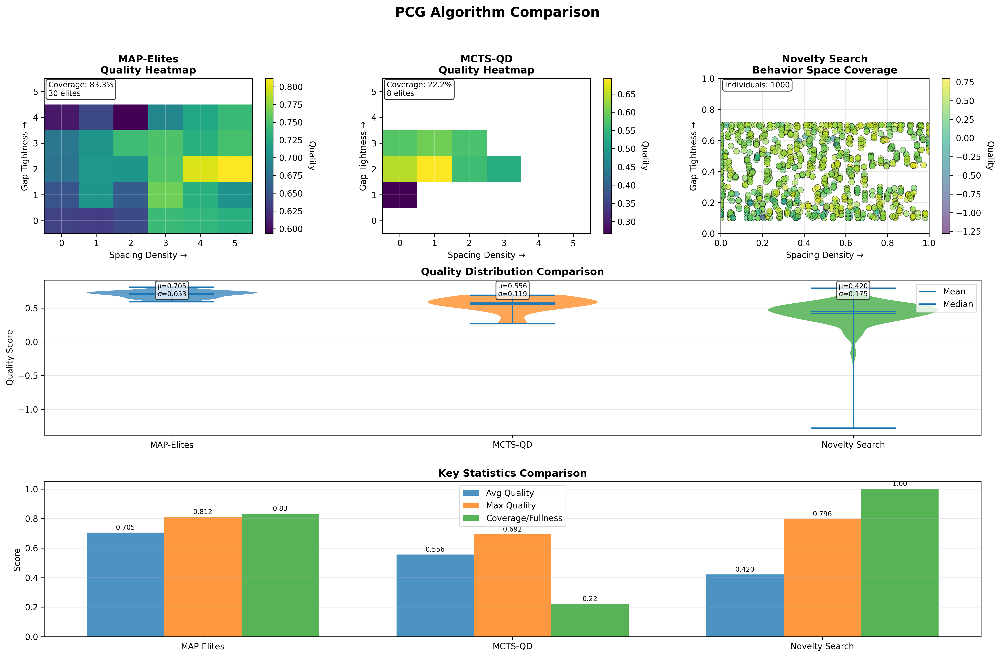

# Procedural Content Generation for Flappy Bird: A Comparative Study of Quality-Diversity Algorithms

**Authors:** Katarzyna Szmagara, Kornelia Makowska

---

## Abstract

This project presents a comparative study of procedural content generation (PCG) techniques applied to a Flappy Bird-style game. We implemented three quality-diversity algorithms—MAP-Elites, MCTS-QD, and Novelty Search—to automatically generate diverse and balanced game levels. The levels are evaluated using AI-controlled bots with distinct play styles, enabling systematic assessment of level quality across multiple dimensions including playability, difficulty progression, and item distribution. Our results demonstrate that quality-diversity approaches can effectively generate diverse level sets while maintaining consistent quality metrics, with MAP-Elites achieving the highest coverage-quality balance.

---

## 1. Introduction

### Problem Statement

Manual level design in platform games is time-consuming and often results in repetitive content with inconsistent difficulty curves. While simple in mechanics, games like Flappy Bird require careful balancing of obstacle placement, spacing, and pacing to create engaging gameplay experiences. The challenge intensifies when introducing additional mechanics such as collectible items, power-ups, and debuffs, which add complexity to the design space.

### Justification

**Problem Justification:** Automated level generation addresses the scalability limitations of manual design, enabling the creation of large, diverse content libraries while maintaining quality standards. This is particularly valuable for games with procedural or infinite gameplay modes, where content exhaustion is a critical concern.

**Methodology Justification:** Quality-diversity (QD) algorithms are well-suited for this problem because they:

1. **Explore diverse solutions** across the behavioral space, ensuring variety in generated content
2. **Maintain quality** within each behavioral niche, preventing degenerate or unplayable levels
3. **Enable designer control** through explicit behavioral characterization (e.g., difficulty, item density)
4. **Provide interpretable archives** that map directly to gameplay characteristics

We chose to compare three prominent QD approaches—MAP-Elites, MCTS-QD, and Novelty Search—to understand their relative strengths in the game content generation domain.

---

## 2. Background and Literature

**MAP-Elites** [Mouret & Clune, 2015] discretizes the behavioral space into a grid, storing the highest-quality solution in each cell. It has been successfully applied to game level generation [Khalifa et al., 2018], demonstrating effective exploration of design spaces.

**Monte Carlo Tree Search (MCTS)** [Browne et al., 2012] builds a search tree through iterative simulation, balancing exploration and exploitation using the UCB1 formula. When combined with quality-diversity principles (MCTS-QD), it can generate diverse content while leveraging the tree structure for efficient search.

**Novelty Search** [Lehman & Stanley, 2011] rewards behavioral novelty rather than objective fitness, encouraging exploration of the behavioral space. It excels at discovering unexpected solutions and avoiding local optima.

---

## 3. Methodology

### 3.1 Game Implementation

We extended the classic Flappy Bird mechanics with additional gameplay elements (power-ups and debuffs).

**Mechanics:**

- Continuous horizontal scrolling at 30 pixels/second
- Gravity-based physics
- Pipe obstacles with variable gaps
- Collision detection
- **Coins:** Collectible items that increase score non-linearly: `score = min((1 + n/3)^1.5, 130)`
- **Power-ups:** Shield (collision immunity), Small Size (easier navigation), Slow Motion (reduced scroll speed)
- **Debuffs:** Speed Up (increased scroll speed), Large Size (harder navigation)

### 3.2 Level Genome Representation

Levels are encoded as vectors controlling:

1. **Pipe Parameters:**

   - `pipe_spacing`: horizontal distance between consecutive pipes
   - `gap_size`: vertical gap in pipes
   - `max_height_change`: maximum vertical shift between consecutive pipes
   - `gap_center_variance`: variability in gap vertical position

2. **Item Spawn Rates:**

   - `coin_spawn_rate`: probability of coin near each pipe
   - `powerup_spawn_rate`: probability of power-up spawn
   - `debuff_spawn_rate`: probability of debuff spawn

3. **Item Placement:**
   - `coin_offset_min/max`: vertical offset range for coin placement
   - `item_spacing`: minimum distance between items

### 3.3 AI Bot Implementations

Three AI bots with distinct strategies evaluate generated levels:

**Aggressive Bot:**

- Minimal jumping unless necessary for survival

**Reactive Bot:**

- Position-based decision making relative to gap center

**Coin Collector Bot:**

- Prioritizes coin collection while maintaining safety margin
- Uses A\* pathfinding with heuristic combining coin proximity and collision avoidance
- Willing to take detours for high-value coins
- Avoids debuffs and collects buffs

_Note: Coin Collector and other advanced bots inherit from `AStarBot`, which implements A_ pathfinding with physics simulation for optimal decision-making.\*

### 3.4 Quality Evaluation Metrics

Level quality is computed as a weighted combination of four components:

**1. Playability (30%):**

```
Survival score: 1 - |survival_rate - 0.25| / 0.25
Progress score: min(1.0, avg_distance / 900)
No-death penalty: 1 - (instant_deaths * 2)
Playability = 0.5 × survival + 0.3 × progress + 0.2 × no_death
```

**2. Hardness (30%):**

```
Gap tightness: normalized gap size (smaller = harder)
Spacing density: normalized pipe spacing (closer = harder)
Hardness = 0.5 × gap_tightness + 0.5 × spacing_density
```

**3. Progression (25%):**

```
Monotonicity: proportion of increasing score bins
Smoothness: 1 - (max_diff / avg_diff) / 10
Progression = 0.6 × monotonicity + 0.4 × smoothness
```

**4. Item Richness (15%):**

```
Coin score: 1 - |coins_per_pipe - 0.40| / 0.40
Buff score: 1 - |buffs_per_pipe - 0.15| / 0.15
Variety bonus: 0.2 if both coins and buffs present
Item richness = 0.5 × coin + 0.3 × buff + variety
```

Additional penalties discourage degenerate solutions:

- **Flat Bot Penalty:** Penalizes levels passable without jumping
- **Vertical Variance Penalty:** Penalizes monotonous vertical patterns

### 3.5 Behavioral Characterization

The behavioral space is two-dimensional:

1. **Gap Tightness**
2. **Spacing Density**

These features provide intuitive, designer-controllable characterization of level difficulty and pacing.

### 3.6 PCG Algorithm Implementations

#### MAP-Elites

- **Archive:** 6×6 grid discretizing the behavioral space
- **Initial Population:** 250 random genomes
- **Iterations:** 2000
- **Mutation:** Gaussian noise (σ=0.25, rate=0.45)
- **Selection:** Random elite from archive
- **Evaluation:** 3 bots × 2 runs × 30 seconds each

**Algorithm:**

```
1. Initialize archive with random samples
2. For each iteration:
   a. Select random elite from archive
   b. Mutate genome parameters
   c. Evaluate with multiple AI bots
   d. Compute quality and behavior features
   e. Add to archive if cell is empty or quality is higher
3. Return archive of elites
```

#### MCTS-QD

- **Archive:** 6×6 grid (same as MAP-Elites)
- **Iterations:** Variable (level-building iterations)
- **Simulations per level:** Configurable depth of tree search
- **Exploration constant:** 1.414 (√2, standard UCB1)
- **Target pipes:** 17 ± 2 (randomized for diversity)

**Algorithm:**

```
1. For each iteration:
   a. Build level using MCTS tree search:
      - Each node represents partial level state
      - UCB1 guides pipe parameter selection
      - Rollout completes level randomly
   b. Evaluate completed level
   c. Compute behavior features
   d. Add to archive if quality is superior
2. Return archive
```

#### Novelty Search

- **Archive:** Unstructured collection (max 1000 individuals)
- **Initial Population:** 200 random genomes
- **Iterations:** 2000
- **k-Nearest Neighbors:** 15
- **Mutation:** Gaussian noise (σ=0.25, rate=0.45)

**Algorithm:**

```
1. Initialize archive with random samples
2. For each iteration:
   a. Select random individual from archive
   b. Mutate genome
   c. Evaluate with bots
   d. Compute novelty: avg distance to k-nearest in behavior space
   e. Add if novelty exceeds threshold or archive not full
3. Return archive
```

## 4. Experiments and Results

### 4.1 Experimental Setup

All experiments were conducted with:

- **Evaluation:** 3 AI bots (Aggressive, Reactive, Coin Collector)
- **Archive dimensions:** 6×6 grid (36 behavioral cells)
- Map Elites had 1000 iterations
- MCTS had 36 iterations with 1000 simulations
- Novelty Search had 2000 iterations



### 4.2 MAP-Elites Results

**Observations:**

- Consistently filled multiple behavioral niches
- Generated levels span full spectrum from tight-sparse to loose-dense configurations
- Quality scores stabilized after ~500 iterations
- Best levels balanced all four quality components effectively

### 4.3 MCTS-QD Results

**Observations:**

- MCTS-QD showed bias toward behaviorally similar solutions due to tree structure
- Computational cost higher than MAP-Elites due to tree maintenance
- Effective for targeted generation within specific behavioral regions

### 4.4 Novelty Search Results

**Observations:**

- Excellent exploration of behavioral extremes
- Some generated levels had lower quality scores but higher behavioral uniqueness
- Effective for discovering edge cases and unexpected level configurations

## 5. How to Run the Code

**Manual Play:**

```bash
python3 src/main.py
```

- Select "Start Game" from menu

**AI Bot Play:**

```bash
python3 src/main.py

```

- Select "Play as Bot" from menu

Bot options: `aggressive`, `reactive`, `coin_collector`

### 5.3 Running PCG Algorithms

**MAP-Elites:**

```bash
# Generate levels
python3 src/pcg/map_elites/run_map_elites.py \
    --iterations 2000 \
    --initial-samples 250 \
    --output data/map_elites/archive.json \
    --plot

# Test generated levels
python3 src/tests/test_top3_levels.py
```

**MCTS-QD:**

```bash
# Generate levels
python3 src/pcg/mcts/run_mcts_qd.py

# Test levels
python3 src/tests/test_mcts_levels.py
```

**Novelty Search:**

```bash
# Generate levels
python3 src/pcg/novelty/run_novelty_search.py

# Test levels
python3 src/tests/test_novelty_levels.py
```

### 5.4 Visualization and Analysis

```bash
# Visualize an archive
python3 src/pcg/visualize_results.py data/map_elites/archive.json

```

## 6. Conclusions

### 6.1 Summary of Results

This project successfully implemented and compared three quality-diversity algorithms for procedural level generation in a Flappy Bird-style game. Key findings:

1. **Quality-diversity algorithms effectively balance exploration and optimization** in game content generation, producing diverse level sets with consistently high quality scores.

2. **MAP-Elites achieved the best coverage-quality trade-off**, efficiently filling the behavioral space while maintaining quality standards.

3. **Multi-bot evaluation provides robust quality assessment**, with different bot strategies exposing different level characteristics.
